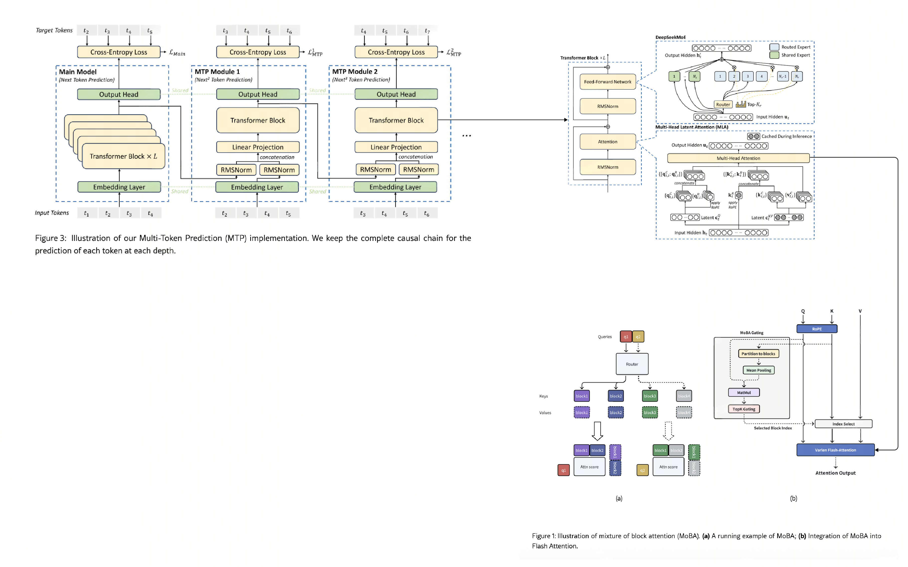
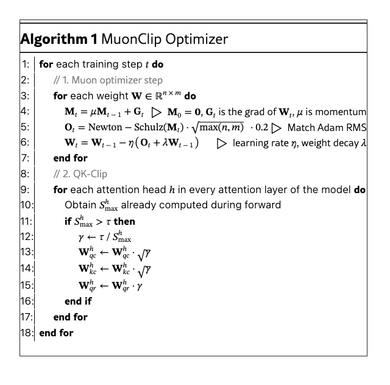

## A heavily modified NanoGPT 

### Motivation:
This repo basically serves as a way to see how I can implement the novel mechanisms as shown in DeepSeek Papers & other relative research papers into a small simple and concise LLM (that is basically NanoGPT). It is a small trained implementation of Deepseek (190m params) with a MuonClip Optimizer

### TODO:

- CUDA support (for now has CPU & MTS support)

- GRPO (r1) (via GRPOTrainer class) 

- FP8/BF16/BF32 Mixed Precision Training 

- Dualpipe Parallelism (well probably requires some CUDA understand)

### General Architecture

The model consists of a main backbone containing 8 layers of transformer blocks. This main module is followed by two MTP branches, each with 2 additional transformer layers. During training, these branches operate in a causal chain, where the output of the main module and previous branches is used as input for subsequent branches to predict future tokens

### Components:

#### Attention:

The attention mechanism is built on three core components. It begins with Multi-Latent Attention (MLA), a projection scheme that generates latent query and key representations. Integrated within this MLA process is a Decoupled RoPE strategy, which splits these representations into position-aware and content-aware channels for more expressive power. 
Finally, these specialized vectors are processed by Mixture of Block Attention (MoBA), which performs the final efficient and sparse attention calculation. This is located within the Multi-Head Attention block above

#### FFN:
For its feed-forward layers, the model employs DeepSeekMoe, a Mixture of Experts (MoE) architecture by the Deepseek. This replaces the standard FFN with a collection of smaller "expert" networks, and a dynamic router selects which experts process each token. To ensure these experts are used efficiently during training, the model incorporates a crucial auxiliary loss. This loss term acts as a load balancer, incentivizing the router to distribute tokens evenly across all experts, which allows the model to scale its parameter count effectively while keeping the computational cost per token constant

### Optimizer:

This model is then trained on MuonClip, a modified Muon Optimizer that was used to train Kimi K2.

### Items Implemented (Just a List Checker): 
- Multi Latent Attention (K/V cache compression algo and deCoupled RoPe in place)

- MoBA (Mixture of Block Attn module) for long context LLMs

- DeepSeekMoE (with fine grained expert segmentation, shared expert isolation and a modified auxillary load balacer)

- Multi Token Prediction (3 Modules, with 1 Main and 2 MTP modules -> the main module has 8 Layers of Transformer block while each MTP has 2 layers of Transformer Block)

- Inference class

- CustomMTPTrainer (as implemented in huggingface)

### Some Novel Statistics:

This model contains 190m parameters, with about 12 MoE Layers 

Each MoE layer has about 9.45m params with about 7.08m active params per layer (layer referencing to the transformer block again)

### How To train: 

For now:
1. `pip install -r requirements.txt`
2. `python3 custom_trainer.py`

Take note, each iteration takes about 491520 tokens , the token size I have set it to about 1024

### Currently Training:

So far, I have trained the model on several datasets, including

- wikicorpus
- OpenOrca
- InfinityInstruct (to be trianed)
- lmsys-chat-1m (to be trained)

If you have any other suggestions for better datasets, do let me know

### How to inference

Use `inference.py` , remember to load it on the different specific checkpoint that you have trained!

#### Papers for reference:

[Deepseek v2](https://arxiv.org/pdf/2405.04434)\
[Deepseek v3](https://arxiv.org/abs/2412.19437)\
[Deepseek r1](https://arxiv.org/pdf/2501.12948)\
[Innovative Techniques in Deepseek](https://arxiv.org/pdf/2503.11486)\
[Muon Optimizer Repo](https://github.com/KellerJordan/Muon/tree/master)\
[Muon Optimizer Writeup](https://kellerjordan.github.io/posts/muon/)\
[Mixture of Block Attn](https://github.com/MoonshotAI/MoBA?tab=readme-ov-file)