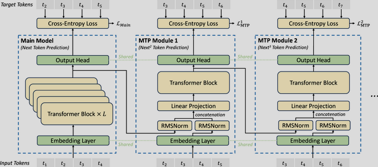
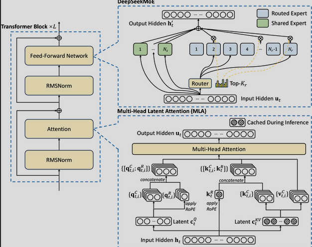

### NanoGPT Incorporating DeepSeek Things

## TLDR: NanoGPT with DeepSeek Implementations + Muon Optimizer

### Motivation:
This repo basically serves as a way to see how I can implement the novel mechanisms as shown in DeepSeek Papers into a small simple and concise LLM (that is basically NanoGPT). It is a small trained implementation of Deepseek (190m params) with a Muon Optimizer

### General Architecture

This entire module represents the Deepseek module. Right now, I have implemented 3 MTP Blocks (1 Main module and 2 MTP Modules). The main module contains 8 Layers of Transformer block while each of the remaining MTP modules only contains 2 layers of transformer block (albeit they put only 1 there -> possibly because most of the context and space representation is already done in the main module).

Each transformer block basically contains RMSNorm with the attention being MLA. Yes it contians the K/V Cache compression algorithm and decoupled RoPe in place too. This then concats with the previous value before undergoing RMSNorm again to a FFN that is DeepSeekMoE. DeepSeekMoE was a little more complex as I thought since it contains fine grained experts segmentations, shared expert iso and a modified aux load balancer for even distribution between experts)

### Items Implemented (Just a List Checker): 
- Multi Latent Attention (K/V cache compression algo and deCoupled RoPe in place)

- DeepSeekMoE (with fine grained expert segmentation, shared expert isolation and a modified auxillary load balacer)

- Multi Token Prediction (3 Modules, with 1 Main and 2 MTP modules -> the main module has 8 Layers of Transformer block while each MTP has 2 layers of Transformer Block)

- CustomMTPTrainer (as implemented in huggingface)

- Muon Optimizer (fork from the original muon optimizer and implemented it )

### Things I want to further implement:
- GRPO (r1)
- FP8 Mixed Precision Training

### Some Novel Statistics:

This model contains 190m parameters, with about 12 MoE Layers 

Each MoE layer has about 9.45m params with about 7.08m active params per layer (layer referencing to the transformer block again)

### How To train: 

1. Fork Andrej Karpathy's NanoGPT repo
2. Replace `train.py` and `model.py` with the files here 
3. Perform the same training process as stated in the NanoGPT guide 

Take note, each iteration takes about 491520 tokens , the token size I have set it to about 1024

#### DeepSeek Papers: 

[Deepseek v2](https://arxiv.org/pdf/2405.04434)\
[Deepseek v3](https://arxiv.org/abs/2412.19437)\
[Deepseek r1](https://arxiv.org/pdf/2501.12948)\
[Innovative Techniques in Deepseek](https://arxiv.org/pdf/2503.11486)\
[Muon Optimizer Repo](https://github.com/KellerJordan/Muon/tree/master)\
[Muon Optimizer Writeup](https://kellerjordan.github.io/posts/muon/)